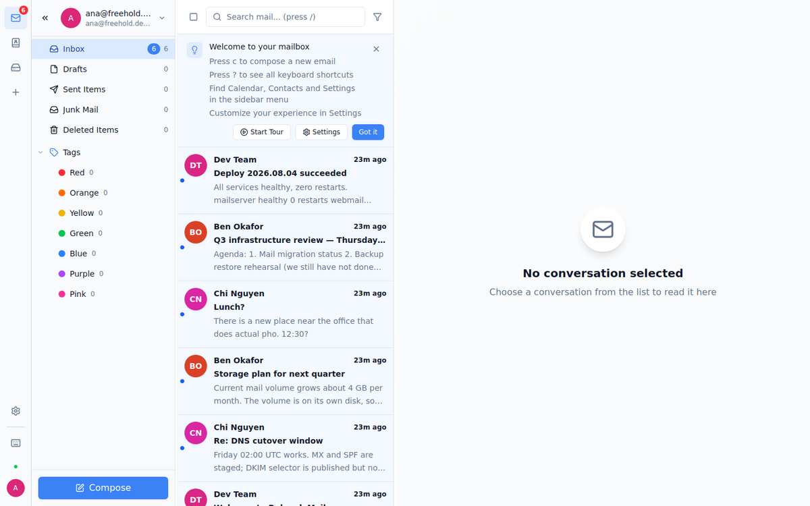
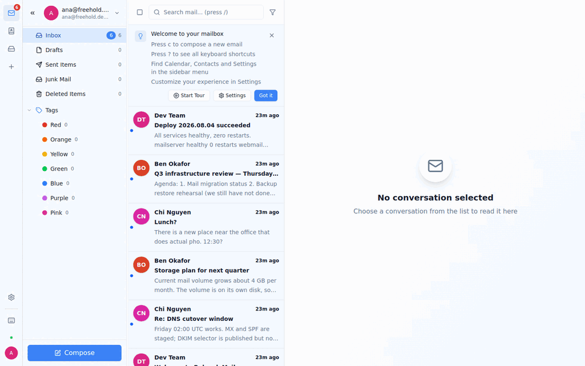

<!-- Last-touched: 2026-08-06 — licence list completed and the "memory-safe" claim corrected. -->
<p align="center">
  <picture>
    <source media="(prefers-color-scheme: dark)" srcset="../../../docs/media/logo-dark.png">
    
  </picture>
</p>

<p align="center">
  <a href="https://github.com/Novaza-ai/freeholdmail/actions/workflows/ci.yml"></a>
  <a href="https://scorecard.dev/viewer/?uri=github.com/Novaza-ai/freeholdmail"></a>
  <a href="https://www.bestpractices.dev/projects/14076"></a>
  <a href="https://github.com/stalwartlabs/stalwart"></a>
  <a href="https://jmap.io"></a>
  <a href="https://github.com/Novaza-ai/freeholdmail/attestations"></a>
  <a href="https://github.com/Novaza-ai/freeholdmail/releases/latest"></a>
  <a href="../../../LICENSE"></a>
  <a href="../../../THIRD_PARTY_LICENSES.md"></a>
  <a href="../../../CHANGELOG.md"></a>
</p>

[English](../../../README.md) · **Español** — La versión en inglés es la autoritativa, consulte [`TRANSLATIONS.md`](../../../TRANSLATIONS.md)

> **Esta traducción es una cortesía.** Si algo en ella entra en conflicto con la versión en inglés,
> el inglés siempre prevalece. Las traducciones pueden quedar desactualizadas. Verifique siempre
> las decisiones de seguridad y de licencia contra el original en inglés.

# Freehold Mail

**Deje de alquilar su bandeja de entrada.** Una pila de correo completa y autoalojada: servidor
de correo en Rust, cliente web moderno.

> *Freehold* (dominio pleno): una propiedad que es enteramente suya, sin arrendador ni contrato de
> alquiler que renovar. Esa es la diferencia entre ejecutar esto y alquilarle un buzón a alguien
> cuyo modelo de negocio son sus datos.

<p align="center">
  
</p>

Servidor de correo, webmail y terminación TLS: conectados entre sí, con un instalador que genera
sus secretos y le indica exactamente qué registros DNS configurar. SSO opcional cuando lo quiera,
ausente cuando no.

> **Estado: pre-1.0.** La edición predeterminada se ha probado de extremo a extremo: un mensaje
> real recorre SMTP → buzón → IMAP. La edición SSO arranca y su base de datos y el descubrimiento
> OIDC están verificados, pero la versión de Keycloak incluida y el flujo de inicio de sesión en el
> navegador no lo están. Lea [Brechas conocidas](../../../CHANGELOG.md#known-gaps-do-not-publish-without-deciding-these)
> antes de depender de esto.

---

## Verlo funcionar

El webmail incluye un recorrido guiado. Este es ese recorrido, grabado contra una pila real: los
mensajes se entregan por SMTP y se leen de vuelta por IMAP mediante `scripts/seed_demo.py`, no
están simulados:

<p align="center">
  
</p>

Todas las imágenes que aparecen aquí se regeneran mediante scripts, nunca se retocan: consulte
[`docs/media/README.md`](../../../docs/media/README.md) para ver los comandos.

## Por qué existe

Autoalojar el correo suele ser o bien un fin de semana pegando Postfix, Dovecot, Rspamd y un
webmail, o bien un buzón alojado donde otra persona lee sus metadatos. Freehold Mail es la tercera
opción: un único repositorio que ensambla una pila moderna que usted mismo ejecuta, en una máquina
que controla. El servidor de correo y el webmail están escritos en lenguajes seguros en memoria;
nginx y PostgreSQL están en C, así que «seguro en memoria» describe las partes que elegimos, no la
pila entera.

**Qué es:** orquestación. Archivos Compose, una configuración de nginx, un instalador y
documentación honesta. **Qué no es:** un fork ni una reescritura del servidor de correo de nadie.

## Dos ediciones

| Edición | Incluye | Inicio de sesión | Probado E2E |
|---------|----------|-------|------------|
| **Full Mail** (predeterminada) | servidor de correo + webmail + nginx | usuario/contraseña nativos | ✅ sí |
| **Mail + SSO** | lo anterior **+ Keycloak + PostgreSQL** | OIDC/SSO | ⚠️ parcial: la pila arranca, la base de datos y el descubrimiento OIDC están verificados en Keycloak 24; la configuración 26.0 incluida y el ciclo completo de inicio de sesión en el navegador aún no se han medido. Consulte [Brechas conocidas](../../../CHANGELOG.md#known-gaps-do-not-publish-without-deciding-these) |

Nunca toca Keycloak a menos que quiera SSO; reside en un archivo overlay opcional.

## Inicio rápido

Requisitos: un host Linux con Docker y Compose v2, un dominio que usted controle, los puertos
25/465/587/993/80/443 accesibles y un certificado TLS.

```bash
git clone https://github.com/Novaza-ai/freeholdmail && cd freeholdmail
./install.sh
```

> **¿Acaba de alquilar un servidor, o está a punto de hacerlo?** Lea primero
> [`docs/HOSTING.md`](../../../docs/HOSTING.md). Va desde un VPS vacío hasta un buzón funcionando,
> con un comando de verificación en cada paso, y nombra lo único que no podrá arreglar después:
> **la mayoría de los proveedores baratos bloquean el puerto 25 saliente**, lo que hace imposible
> el correo por bien que configure esto. También tiene cifras medidas de RAM, CPU y disco para que
> alquile el tamaño adecuado en lugar de adivinar.

El instalador pregunta por su edición y su dominio, y luego:

1. genera secretos aleatorios robustos en `.env` (modo 600, `umask 077`: nada codificado de forma fija);
2. fija las imágenes de contenedor por digest;
3. resuelve sus rutas de Let's Encrypt (los enlaces simbólicos `live/` no funcionan dentro de los contenedores);
4. levanta la pila e imprime los comandos para crear su primer buzón.

Después cree un buzón e inicie sesión en `https://<your-domain>`:

```bash
# domain, then user — the roles field is required, or SMTP AUTH refuses the account
curl -u admin:$STALWART_FALLBACK_ADMIN_SECRET -X POST http://127.0.0.1:8080/api/principal \
  -H 'Content-Type: application/json' -d '{"type":"domain","name":"example.com"}'

curl -u admin:$STALWART_FALLBACK_ADMIN_SECRET -X POST http://127.0.0.1:8080/api/principal \
  -H 'Content-Type: application/json' \
  -d '{"type":"individual","name":"you@example.com","secrets":["<password>"],
       "emails":["you@example.com"],"roles":["user"]}'
```

Por último, configure sus registros DNS: [`docs/DNS.md`](../../../docs/DNS.md) contiene MX, SPF,
DKIM y DMARC.

## Arquitectura

```
Browser ─HTTPS─▶ nginx ─┬─ /  and  /api/*  ─▶ Bulwark webmail (FE)   :3000
                        ├─ /jmap, /.well-known/jmap ─▶ Stalwart  :8080/JMAP
                        └─ /.well-known/openid-configuration ─▶ Keycloak (SSO edition)
SMTP/IMAP clients ───────────────────────────────▶ Stalwart  :25 :465 :587 :993
```

`/api/*` pertenece al webmail, que sirve allí sus propias rutas de configuración y de sesión. Solo
`/jmap` y el descubrimiento JMAP llegan al servidor de correo; su API de administración
deliberadamente no se expone a través del proxy.

Cada caja es un contenedor independiente e intercambiable. Del frontend al backend la comunicación
es **solo de red**: JMAP sobre HTTP, sin enlazado de código. Esa frontera es lo que permite que
este repositorio sea MIT mientras cada componente conserva su propia licencia.

## Cómo se compara

| | Freehold Mail | Mailu / Mailcow | docker-mailserver | Google Workspace |
|---|---|---|---|---|
| Servidor de correo | Stalwart (Rust, nativo de JMAP) | Postfix + Dovecot | Postfix + Dovecot | — |
| RAM en reposo (medida) | **218–288 MiB** | mailcow: 6 GiB min (docs) | — | — |
| Webmail incluido | ✅ | ✅ | ❌ (aporte el suyo) | ✅ |
| JMAP | ✅ | ❌ | ❌ | ❌ |
| SSO/OIDC | ✅ edición opcional | parcial | ❌ | ✅ |
| Usted conserva los datos | ✅ | ✅ | ✅ | ❌ |
| Madurez | **pre-1.0** | maduro | maduro | comercial |

Mailu, Mailcow y docker-mailserver son excelentes y están mucho más probados en batalla. Elija
Freehold Mail si busca específicamente un servidor de correo en Rust y nativo de JMAP, con webmail
y SSO opcional en un solo lugar.

## El alcance, con honestidad

**Ahora:** buzones, SMTP/IMAP/JMAP, webmail, TLS, SSO opcional: un reemplazo creíble para un buzón
alojado.

**Ahora no:** correo masivo o de marketing, boletines, bandejas de entrada compartidas de equipo,
ticketing, herramientas de migración desde otros proveedores ni un panel de control gestionado. El
envío masivo en particular es una disciplina de entregabilidad, no un interruptor de función: no lo
dé por hecho.

**Hoja de ruta:** consulte [`ROADMAP.md`](../../../ROADMAP.md): a corto plazo se trata de
confiabilidad (SSO verificado sobre el Keycloak incluido, la línea actual del servidor de correo
upstream, entregabilidad medida en un dominio real). Más adelante queremos que esta pila sea la que
los agentes de software puedan usar de forma segura: un servidor MCP sobre JMAP y credenciales por
agente, acotadas y revocables, en lugar de entregarle su contraseña a un bot. Nada de eso está
construido todavía, y el proyecto deliberadamente no lleva ese nombre. **Se buscan contribuciones
en el trabajo sobre agentes: consulte "Help wanted" en la hoja de ruta.**

## ⚖️ Licencia

- **Este repositorio** (orquestación, configuración, instalador, documentación): **MIT** — consulte [`LICENSE`](../../../LICENSE).
- **Los programas que despliega conservan sus propias licencias** y se obtienen como imágenes
  publicadas; este repositorio no contiene nada de su código fuente:
  - Stalwart Mail Server — **AGPL-3.0-only OR SELv1** *(licencia dual; no "or later")*
  - Bulwark Webmail — **AGPL-3.0-only**
  - Keycloak — **Apache-2.0** *(edición SSO)*
  - PostgreSQL — **PostgreSQL License** *(edición SSO)*
  - nginx — **BSD-2-Clause**

Si **modifica** Stalwart o Bulwark y lo ofrece a terceros, la AGPL le exige publicar el código
fuente modificado *de ese componente*. Ejecutar las imágenes sin modificar no lo exige.
Detalles: [`THIRD_PARTY_LICENSES.md`](../../../THIRD_PARTY_LICENSES.md) y [`NOTICE`](../../../NOTICE).

## Seguridad

El relay abierto está denegado, el envío (submission) requiere autenticación y los mecanismos de
contraseña (`PLAIN`/`LOGIN`) solo se ofrecen después de STARTTLS: todo medido, no supuesto. También
existen debilidades reales que debe prever, incluida una API de administración upstream que
devuelve las contraseñas de las cuentas en texto claro. **Lea [`SECURITY.md`](../../../SECURITY.md)
antes de exponer esto a Internet.**

## Pruebas y operación

Ambas están en el repositorio: puede reproducir usted mismo cada afirmación anterior:

```bash
tests/test_config.sh      # static: both editions validate, no secrets, digests pinned … (~seconds)
tests/test_e2e.sh         # real: stack up → send a message → read it back over IMAP (~2 min)
tests/test_e2e.sh --sso   # same, plus Keycloak + PostgreSQL
```

`test_e2e.sh` construye una pila desechable en puertos solo de loopback, con sus propios volúmenes
y nombres de contenedor, y la desmonta al salir: no perturbará un despliegue en marcha. Consulte
[`tests/README.md`](../../../tests/README.md), incluido lo que estas pruebas deliberadamente
**no** cubren.

Las operaciones del día 2 —copias de seguridad, renovación de certificados, gestión de buzones,
actualizaciones, guías de incidentes— están en [`docs/RUNBOOK.md`](../../../docs/RUNBOOK.md). Los
requisitos previos están en [`docs/REQUIREMENTS.md`](../../../docs/REQUIREMENTS.md).

## Contribuir

Consulte [`CONTRIBUTING.md`](../../../CONTRIBUTING.md). Una regla de la casa: las afirmaciones
sobre el comportamiento en ejecución necesitan mediciones, no un "funciona en mi máquina".

Quién decide qué, cómo convertirse en mantenedor y qué pasa con usted si este proyecto llega a
abandonarse: [`GOVERNANCE.md`](../../../GOVERNANCE.md). De quién esperar respuesta, y una
declaración honesta del bus factor: [`MAINTAINERS.md`](../../../MAINTAINERS.md).

## Quién construye esto

Dirigido por **Daika Ginza** — [GitHub](https://github.com/daikaginza) ·
[Substack](https://substack.com/@daikaginza) ·
[LinkedIn](https://www.linkedin.com/in/daikaginza/) — junto con
[@anhkk1245](https://github.com/anhkk1245), en
**[Novaza Solution JSC](https://novaza.ai)**.

Ejecutamos los componentes de esta pila (Stalwart y Bulwark) en producción para nuestro propio
correo, y construimos Freehold Mail para empaquetar esa arquitectura para cualquiera que quiera
autoalojarla. Con licencia MIT; consulte [`LICENSE`](../../../LICENSE) y [`NOTICE`](../../../NOTICE).

El equipo completo, cómo se toman las decisiones y cómo unirse:
[`MAINTAINERS.md`](../../../MAINTAINERS.md) · [`GOVERNANCE.md`](../../../GOVERNANCE.md).

> El gráfico de contribuidores de GitHub actualmente solo acredita a `dependabot`, porque nuestros
> commits se crean bajo una identidad de empresa que no está vinculada a una cuenta de GitHub. Si
> contribuye, haga commit con su propio nombre y correo electrónico: allí se le acreditará
> correctamente. `MAINTAINERS.md` explica cómo lo estamos resolviendo para el equipo.

---

No afiliado a Stalwart Labs, al proyecto Bulwark ni a Keycloak.
